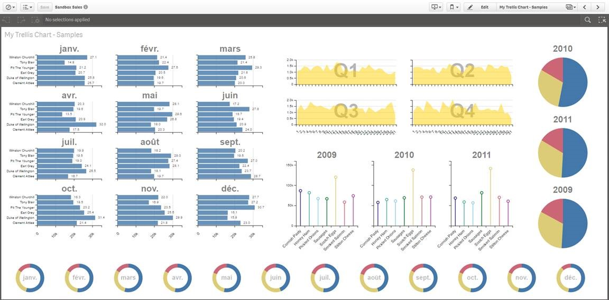

# Qlik Sense Trellis Chart Extension

# Dimensions and Measures

Required at least two dimensions and one measure.
-	First Dimension : Dimension of the chart element
-	Second Dimension : Trellis dimension, on which the chart will be repeated
-	Measure 1 : any expression or measures master items

# Examples of the many possibilities

# Trellis Configuration
**Trellis Settings**

-	Number of Columns and Rows in the trellis grid.
-	Chart Type : 	Bar Chart, Line Chart, Area Chart, Lollipop Chart, Pie Chart, Step Chart
-	Inner Radius (%) : For Pie Chartonly, size of the inner circle for a ring chart (Full pie chart has inner radius % = 0 )
-	Chart Orientation : For All charts, excepted Pie Chart, switch x/y axis
-	Show Grid : Display grid lines in background of the chart

**Label and Axis**
-	Hide Dim-Axis Labels : disable labels on the axis
-	Hide Measure Labels : disable labels on the measure axis
-	Value Labels : display labels on value points (if bar too thin, labels will be automatically hidden)
-	Trellis Label Size : in pixel, size of the label for the trellis dimension
-	Trellis – Labels Positions : at Top or inside the chart

**Color Settings**
-	Colors : Single color, color by dimension (base on QLikColor12 palette) [Color by Measure : coming soon]
-	Select Color : Color picker if single color mode is selected.

# Roadmap
- Enable Selections in chart elements
- Custom tooltip
- Handle a seconf measure, included stacked mode.

Enjoy and stay tuned !

# Installation

1. Download the extension zip, `qlik-trellis-chart_<version>.zip`, from the latest release(https://github.com/qlik-oss/trellis-chart/releases/latest)
2. Install the extension:

   a. **Qlik Sense Desktop**: unzip to a directory under [My Documents]/Qlik/Sense/Extensions.

   b. **Qlik Sense Server**: import the zip file in the QMC.

# Developing the extension

If you want to do code changes to the extension follow these simple steps to get going.

1. Get Qlik Sense Desktop
1. Create a new app and add the extension to a sheet.
2. Clone the repository
3. Run `npm install`
4. Set the environment variable `BUILD_PATH` to your extensions directory. It will be something like `C:/Users/<user>/Documents/Qlik/Sense/Extensions/<extension_name>`.
5. You now have two options. Either run the watch task or the build task. They are explained below. Both of them default to development mode but can be run in production by setting `NODE_ENV=production` before running the npm task.

   a. **Watch**: `npm run watch`. This will start a watcher which will rebuild the extension and output all needed files to the `buildFolder` for each code change you make. See your changes directly in your Qlik Sense app.

   b. **Build**: `npm run build`. If you want to build the extension package. The output zip-file can be found in the `buildFolder`.

# Original author

[github.com/miclae76](https://github.com/miclae76/)

# License

Released under the [MIT License](LICENSE).